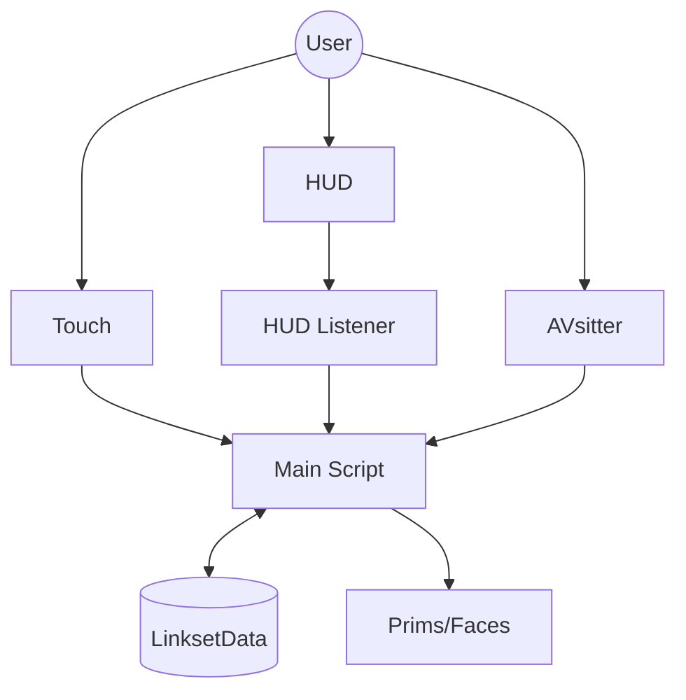

# Technical Overview

## System Architecture

The UMTC system follows a modular architecture separating user interaction, processing, and data storage.

### Component Diagram

### Script Dependencies

| Script | Role | Requirement |
| :--- | :--- | :--- |
| **UMTC Main Script** | Processing Engine | **Required** |
| **UMTC LSD Loader** | Data Loader | Setup Only |
| **UMTC Data Dump** | Data Extractor | Setup Only |
| **UMTC HUD Listener** | Remote Control | Optional (for HUDs) |
| **UMTC Object Prop** | Prop Sync (Sender) | Optional |
| **UMTC Rezzed Prop** | Prop Sync (Receiver) | Optional |

## Performance

### Benchmarks

| Operation | Time | Notes |
| :--- | :--- | :--- |
| **Menu Display** | 0.1 - 0.5s | First load slightly slower due to caching. |
| **Texture Apply** | 0.1 - 2.0s | Depends on number of prims and faces. |
| **LSD Read** | < 0.001s | Extremely fast. |
| **LSD Write** | ~0.002s | Fast, but limited by total capacity. |

### Optimization Tips

1.  **Use Selective Face Dumping**: Only dump data for faces that actually change (`t;name~0,1`).
2.  **Skip Duplicates**: Use `t;name~` to skip dumping identical prims.
3.  **Choose Correct Mode**: Don't use `PBR+Non-PBR` if you only need PBR. It uses significantly more memory.
